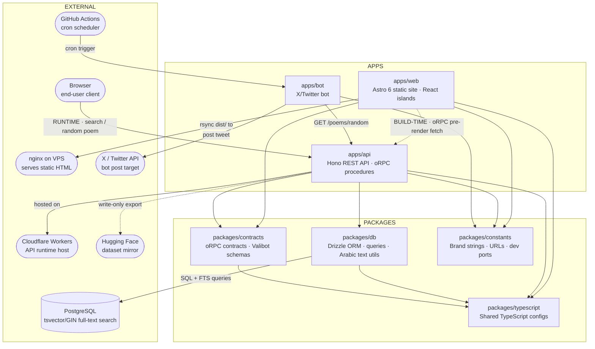

<div align="center">

# Qafiyah

<picture>
  <source media="(prefers-color-scheme: dark)" srcset=".github/readme_banner_darkmode.png" />
  <source media="(prefers-color-scheme: light)" srcset=".github/readme_banner_lightmode.png" />
  
</picture>

**An open-source repository of Arabic poetry, with database dumps, REST API, and web interface.**

[](https://turbo.build/repo)
[](https://workers.cloudflare.com)
[](https://astro.build)
[](https://bun.sh)
[](https://www.typescriptlang.org)
[](https://hono.dev)
[](https://orm.drizzle.team)
[](https://api.qafiyah.com)
[](https://orpc.unnoq.com)
[](https://valibot.dev)
[](https://scalar.com)

[Website](https://qafiyah.com) · [API](https://api.qafiyah.com) · [X Bot](https://x.com/qafiyahdotcom) · [HuggingFace Dataset](https://huggingface.co/datasets/qafiyah/classical-arabic-poetry) · [Database Dumps](dumps/)

</div>

## About

Qafiyah is an open-source classical Arabic poetry corpus containing **944,844 verses** from **932 poets** spanning **10 historical eras**. The project provides a static website, a public REST API, downloadable PostgreSQL dumps, and a Hugging Face dataset to support readers, researchers, and developers building on top of classical Arabic literature.

## Table of Contents

- [Qafiyah](#qafiyah)
  - [About](#about)
  - [Table of Contents](#table-of-contents)
  - [Features](#features)
  - [Tech Stack](#tech-stack)
    - [Core](#core)
    - [Web (`apps/web`)](#web-appsweb)
    - [API (`apps/api`)](#api-appsapi)
    - [Bot (`apps/bot`)](#bot-appsbot)
    - [Data Layer](#data-layer)
    - [Tooling](#tooling)
  - [Architecture](#architecture)
  - [Database](#database)
  - [Getting Started](#getting-started)
    - [Prerequisites](#prerequisites)
    - [Installation](#installation)
    - [Development](#development)
  - [Scripts](#scripts)
  - [API Documentation](#api-documentation)
  - [Deployment](#deployment)
  - [Contributing](#contributing)
  - [Acknowledgments](#acknowledgments)
  - [Documentation](#documentation)
  - [License](#license)

## Features

- **Full-text search** across 944,844 verses with Arabic diacritics normalization
- **Faceted browsing** by era, meter (44 types), rhyme pattern (47 patterns), and theme (27 themes)
- **Static-first web app** pre-rendered at build time from the public API
- **Public REST API** on Cloudflare Workers with auto-generated OpenAPI docs
- **X/Twitter bot** posting a random poem four times daily via GitHub Actions
- **Downloadable PostgreSQL dumps** for offline research and integration
- **Hugging Face dataset** for ML/NLP use cases

## Tech Stack

### Core

| Tool                                         | Purpose                                            |
| -------------------------------------------- | -------------------------------------------------- |
| [Bun](https://bun.sh)                        | Package manager and JavaScript runtime             |
| [Turborepo](https://turbo.build)             | Monorepo task orchestration and build caching      |
| [TypeScript](https://www.typescriptlang.org) | Language across all packages                       |
| [envin](https://github.com/nktnet1/envin)    | Type-safe environment variable loading and parsing |

### Web (`apps/web`)

| Tool                                         | Purpose                                                 |
| -------------------------------------------- | ------------------------------------------------------- |
| [Astro](https://astro.build)                 | Static site framework; pages pre-rendered at build time |
| [React](https://react.dev)                   | Interactive islands (search, nav, random poem)          |
| [TailwindCSS](https://tailwindcss.com)       | Utility-first CSS                                       |
| [Radix Slot](https://www.radix-ui.com)       | Polymorphic-render primitive for component composition  |
| [TanStack Query](https://tanstack.com/query) | Server-state and data-fetching in React islands         |

### API (`apps/api`)

| Tool                                                 | Purpose                                                         |
| ---------------------------------------------------- | --------------------------------------------------------------- |
| [Hono](https://hono.dev)                             | Lightweight HTTP framework on Cloudflare Workers                |
| [oRPC](https://orpc.unnoq.com)                       | Type-safe RPC with shared contracts                             |
| [Valibot](https://valibot.dev)                       | Schema validation for all oRPC contract inputs and outputs      |
| [OpenAPI](https://www.openapis.org)                  | API spec auto-generated from oRPC contracts via `@orpc/openapi` |
| [Scalar](https://scalar.com)                         | Interactive API documentation served at `/v1/docs`              |
| [Cloudflare Workers](https://workers.cloudflare.com) | Serverless runtime; deployed via Wrangler                       |

### Bot (`apps/bot`)

| Tool                                                            | Purpose                                |
| --------------------------------------------------------------- | -------------------------------------- |
| [GitHub Actions](https://github.com/features/actions)           | Cron scheduler and runtime for the bot |
| [twitter-api-v2](https://github.com/PLhery/node-twitter-api-v2) | X/Twitter API client                   |

### Data Layer

| Tool                                     | Purpose                                                       |
| ---------------------------------------- | ------------------------------------------------------------- |
| [Drizzle ORM](https://orm.drizzle.team)  | SQL query builder and schema definitions in `packages/db`     |
| [PostgreSQL](https://www.postgresql.org) | Primary database; full-text search via `tsvector`/GIN indexes |
| [Docker](https://www.docker.com)         | Local Postgres containers for development and testing         |

### Tooling

| Tool                                      | Purpose                                              |
| ----------------------------------------- | ---------------------------------------------------- |
| [Biome](https://biomejs.dev)              | Linting and formatting for all JS/TS files           |
| [Prettier](https://prettier.io)           | Formatting for non-JS assets                         |
| [Vitest](https://vitest.dev)              | Unit and integration tests across all workspaces     |
| [Husky](https://typicode.github.io/husky) | Git hooks                                            |
| [commitlint](https://commitlint.js.org)   | Conventional commit enforcement                      |
| [Knip](https://knip.dev)                  | Detection of unused files, dependencies, and exports |
| [Madge](https://github.com/pahen/madge)   | Circular dependency detection                        |

## Architecture

Qafiyah is a Bun + Turborepo monorepo.

```
qafiyah/
├── apps/
│   ├── web/          Astro 6 static site; queries the API at build time via oRPC, with browser-side fetches for interactive features
│   ├── api/          Hono REST API on Cloudflare Workers
│   └── bot/          X/Twitter bot; posts 4× daily via GitHub Actions cron
└── packages/
    ├── db/           Drizzle ORM schema, queries, Arabic-text utilities, and Postgres client factory
    ├── contracts/    Shared oRPC contract definitions
    ├── constants/    Shared brand, URLs, and dev-port constants
    └── typescript/   Shared TypeScript configs (base, astro, cloudflare, bun)
```

**Data flow:**

- `apps/web` is fully static. It queries the API at build time via oRPC (`src/lib/api/static.ts`) and falls back to the production API from the browser for interactive features.
- `packages/db` is the database layer (Drizzle schema, queries, `createDb` factory); `apps/api` is its sole consumer, with no Drizzle or Postgres imports under `apps/api/src`.
- `packages/contracts` defines the oRPC contracts shared between `apps/api` (server procedures) and `apps/web` (typed client).



## Database

**Current statistics:**

| Entity         | Count   |
| -------------- | ------- |
| Verses         | 944,844 |
| Poems          | 85,342  |
| Poets          | 932     |
| Eras           | 10      |
| Meters         | 44      |
| Rhyme patterns | 47      |
| Themes         | 27      |

PostgreSQL custom-format dumps are published in [`dumps/`](dumps) and refreshed periodically. They are provided for research and integration as an alternative to scraping the API. See the [restore instructions](dumps/README.md); restoring requires PostgreSQL ≥ 17 and `pg_restore`.

## Getting Started

### Prerequisites

- Bun ≥ 1.3.14 (enforced via `packageManager`; the root `preinstall` script aborts under npm, yarn, or pnpm)
- Docker (for the local Postgres containers spun up by `db:setup`)
- PostgreSQL ≥ 17 with `pg_restore` (only needed if you restore the bundled dumps directly; the Dockerized workflow handles this for you)

### Installation

```bash
git clone https://github.com/alwalxed/qafiyah.git
cd qafiyah
bun install
```

### Development

```bash
bun run db:setup   # boots dev + test Postgres in Docker and restores the latest dump
bun run dev        # runs the web app and API in development mode via Turbo
```

## Scripts

| Script              | Description                                                            |
| ------------------- | ---------------------------------------------------------------------- |
| `bun run dev`       | Run the web app and API in development mode via Turbo                  |
| `bun run build`     | Build all workspaces                                                   |
| `bun run test`      | Run Vitest across all workspaces                                       |
| `bun run types`     | Type-check all workspaces with `tsc --noEmit`                          |
| `bun run lint`      | Lint and auto-fix with Biome                                           |
| `bun run format`    | Format JS/TS with Biome and Markdown/MDX with Prettier                 |
| `bun run knip`      | Detect unused files, dependencies, and exports                         |
| `bun run madge`     | Detect circular imports across `apps/` and `packages/`                 |
| `bun run ci`        | Run format, lint, types, test, knip, madge, and `bun audit` in order   |
| `bun run db:setup`  | Boot dev + test Postgres in Docker and restore the latest dump         |
| `bun run clean:dev` | Kill orphan Astro, Wrangler, and Workerd processes from prior dev runs |

## API Documentation

The public REST API is hosted at [`api.qafiyah.com`](https://api.qafiyah.com) and ships with interactive documentation at [`api.qafiyah.com/v1/docs`](https://api.qafiyah.com/v1/docs), generated from oRPC contracts via `@orpc/openapi` and rendered with Scalar. The root URL redirects to the docs.

## Deployment

- **API:** `bun --filter @qafiyah/api run deploy` runs `wrangler deploy --minify`, publishing the Worker to Cloudflare.
- **Web:** the site is self-hosted on a VPS behind nginx. Build locally with `bun --filter @qafiyah/web run build`, then rsync `apps/web/dist/` to `/var/www/qafiyah`. The nginx configuration is checked in at `apps/web/nginx.conf`.
- **Bot:** no deploy step. `.github/workflows/post-poem.yml` runs the bot on a cron schedule (08/12/16/20 UTC) directly from `main`.

## Contributing

Contributions are welcome. Before opening a pull request, please read:

- [Contributing Guidelines](.github/CONTRIBUTING.md)
- [Code of Conduct](.github/CODE_OF_CONDUCT.md)
- [Security Policy](.github/SECURITY.md)

## Acknowledgments

Listed chronologically by date of contribution:

- **[Khalid Alraddady](https://www.linkedin.com/in/khalid-alraddady/)**, AI Engineer at [HRSD](https://www.hrsd.gov.sa/en). Development of the semantic search feature currently under active development.
- **[Khalid Almulaify](https://github.com/khalidmfy)**, PhD in Morphology and Syntax at [IMSIU](https://imamu.edu.sa). Ongoing financial sponsorship ($100/month) and sustained usage of the public API through a [Telegram bot](https://t.me/QafiyahVerseBot).
- **[Malath Alsaif](https://www.linkedin.com/in/malath-a-alsaif-a49a382a7/)**, Software Engineer at [Ejari](https://www.ejari.sa). UI improvements and implementation of the local database development workflow.
- **[Fahad Alghamdi](https://github.com/v0id-user)**, Software Engineer at [Thmanyah](https://thmanyah.com). Diagnosis of a redundant per-request `SELECT 1` health check in the DB middleware.

## Documentation

- [Search Implementation](docs/SEARCH_FEATURE_IMPLEMENTATION.md)

## License

Released under the [MIT License](LICENSE).
